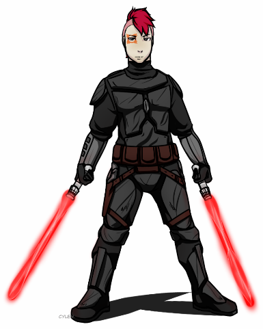

**Aeryn Thall**

| | BIOGRAPHICAL INFORMATION  |
| --- | --- |
| **Homeworld** | Mandalore |
| **Born:** | 999 BBY |
| **Died:** | 783 BBY |
| Alias(s): | Darth Mugen, Mandalore the Uniter, Mandalore the Reborn |
| | **PHYSICAL DESCRIPTION**  |
| **Species:** | - |
| **Gender:** | - |
| **Height:** | - |
| **Mass:** | - |
| **Hair color:** | - |
| **Eye color:** | - |
| **Skin color:** | - |
| | **CHRONOLOGICAL AND POLITICAL AFFILIATIONS**  |
| **Era(s):** | - |
| **Affiliation:** | - |
| **Master:** | - |
| **Apprentice(s):** | - |
| | **FAMILY** |
| **Father:** | - |
| **Mother:** | - |
| **Brother:** | - |
| **Sister:** | - |

***
>"Quote"
> Person

## Introduction

### Pre-Resurrection

First Paragraph.

### Post-Resurection

Second Paragraph.

***

### Powers and Abilities

> Powers and Abilities

***

### Behind the Scenes

> Behind the scenes
